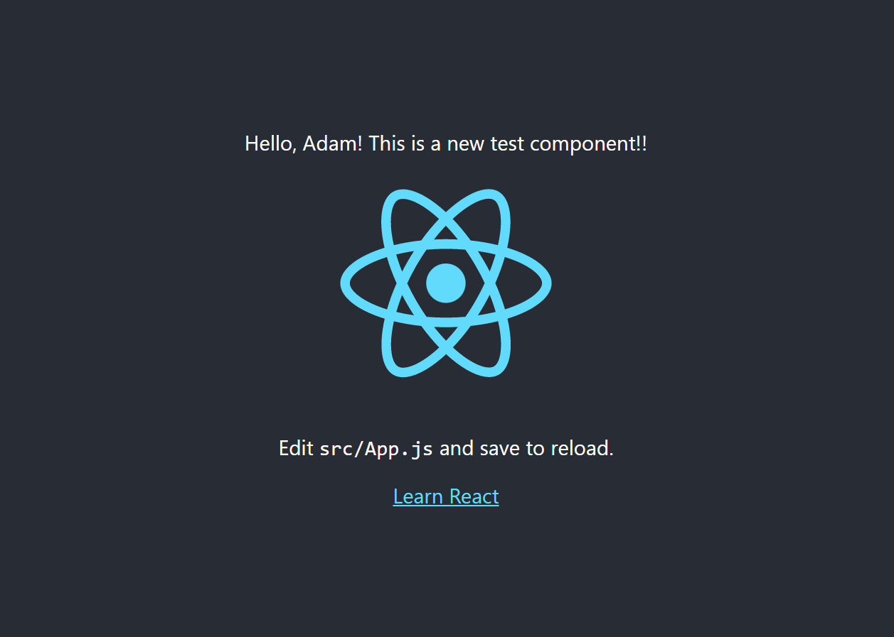

# Create a React Library and import it to a React project

## Log in npm

- Sign in to npm (http://https://www.npmjs.com/)

- Log in on terminal:

```
npm login
```

## Create base project with storybook

- Create project:

```
npx tsdx create my-project
```

- Choose template : react-with-storybook


- Test the storybook:

```
npm run storybook
```

## Publish the npm project

- Change the package name (package.json)

- Publish the package:

```
npm publish --acces public
```

- You can reach it: https://www.npmjs.com/package/@sarnyaia1/aenscomp-lib

## Update the library

- Change index.tsx (src/index.tsx)

- Make some comment and refresh version (major,minor,patch)

```
npm version minor -m "I am updating the library"
```

- Publish again:

```
npm publish --acces public
```

## Testing the created library

- Create a new react project:

```
yarn create react-app testproject
```

- Add the new library:

```
yarn add @sarnyaia1/aenscomp-lib
```

- Import the component to the App.js

```
import { Testcomponent } from '@sarnyaia1/aenscomp-lib';


<Testcomponent yourName="Adam" />
```

- Runt the project:

``` 
yarn start
```

## Result




